# Manual de Usuario - Dulce Patojo SAC v1.0.0

Sistema POS y Administrativo para Cafeteria
Santa Ana, El Salvador

---

## Indice

1. [Introduccion](#1-introduccion)
2. [Acceso al Sistema](#2-acceso-al-sistema)
3. [Panel de Administracion (Admin)](#3-panel-de-administracion-admin)
   - 3.1 Dashboard
   - 3.2 Gestion de Productos y Combos
   - 3.3 Gestion de Usuarios
   - 3.4 Gestion de Mesas
   - 3.5 Promociones
   - 3.6 Inventario
   - 3.7 Ingredientes
   - 3.8 Recetas
   - 3.9 Proveedores
   - 3.10 Reportes
   - 3.11 Configuracion
4. [Caja POS (Cajero)](#4-caja-pos-cajero)
   - 4.1 Realizar un pedido
   - 4.2 Procesar un pago
   - 4.3 Cobros pendientes
   - 4.4 Ticket de venta
5. [Cocina KDS (Cocinero)](#5-cocina-kds-cocinero)
   - 5.1 Visualizar pedidos entrantes
   - 5.2 Cambiar estado de preparacion
   - 5.3 Consultar recetas
6. [Despacho (Despachador)](#6-despacho-despachador)
   - 6.1 Recibir pedidos listos
   - 6.2 Entregar pedidos
   - 6.3 Ver ticket de entrega

---

## 1. Introduccion

**Dulce Patojo SAC** es un sistema de punto de venta (POS) y administracion disenado para cafeterias y restaurantes. El sistema permite gestionar pedidos, cocina, despacho, inventario, ingredientes, recetas, usuarios, promociones y reportes, todo en una sola plataforma con actualizaciones en tiempo real.

### Roles del sistema

| Rol | Acceso principal |
|---|---|
| Admin | Todas las funciones del sistema |
| Cajero | Caja POS, procesar pagos, ver tickets |
| Cocinero | Pantalla de cocina (KDS), ver y actualizar pedidos |
| Despachador | Pantalla de despacho, entregar pedidos |

### Navegacion general

 el menu lateral (sidebar) permite navegar entre las diferentes secciones. Dependiendo de tu rol, veras unas opciones u otras. El sidebar se puede contraer haciendo clic en el icono de hamburguesa en la esquina superior izquierda.

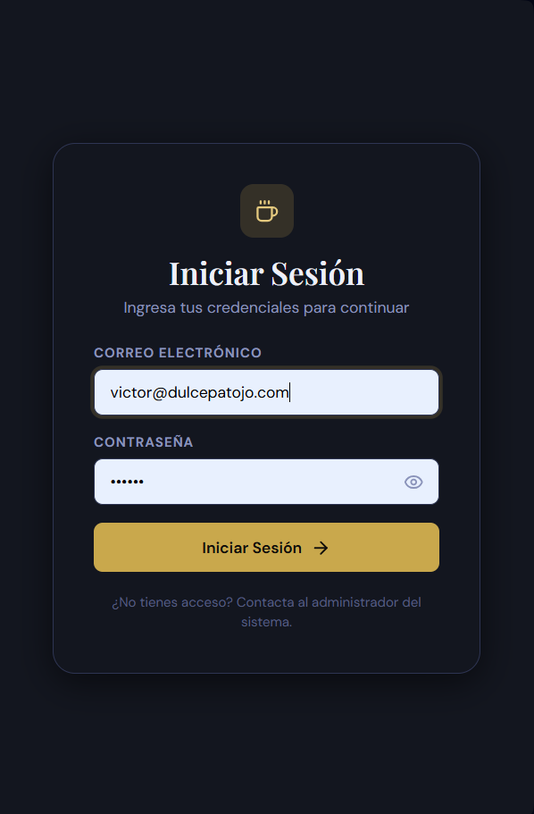

---

## 2. Acceso al Sistema

### 2.1 Iniciar sesion

1. Abre el sistema en tu navegador (la direccion te la proporciona el administrador).
2. Veras la pantalla de bienvenida con el logotipo de Dulce Patojo a la izquierda y el formulario de inicio de sesion a la derecha.
3. Ingresa tu **correo electronico** en el campo correspondiente.
4. Ingresa tu **contrasena**.
5. Haz clic en el boton **Iniciar Sesion**.

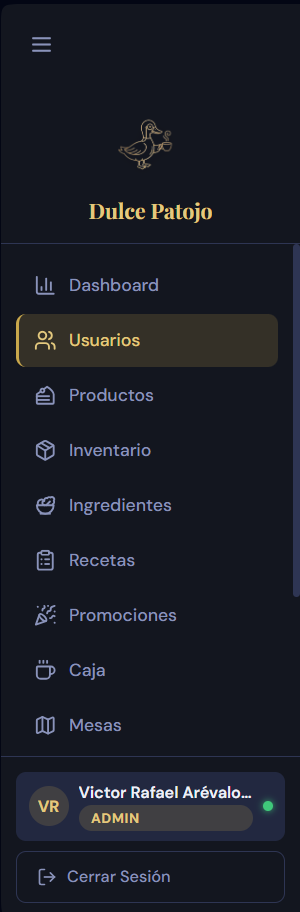

El sistema te redirigira automaticamente a la pantalla principal segun tu rol:
- **Admin** ira al Dashboard
- **Cajero** ira a la Caja POS
- **Cocinero** ira a la Cocina
- **Despachador** ira al Despacho

### 2.2 Cerrar sesion

Haz clic en tu nombre en la parte inferior del menu lateral y selecciona **Cerrar Sesion**, o ve a Configuracion y presiona el boton rojo **Cerrar Sesion**.

### 2.3 Sesion expirada

Si permaneces inactivo por 30 minutos, el sistema cerrara tu sesion automaticamente y te mostrara una pantalla con un contador de 15 segundos para redirigirte al login.

---

## 3. Panel de Administracion (Admin)

Esta seccion describe todas las funciones disponibles para el rol de Administrador.

### 3.1 Dashboard

El Dashboard es la pantalla de inicio del administrador. Muestra un resumen general del negocio.

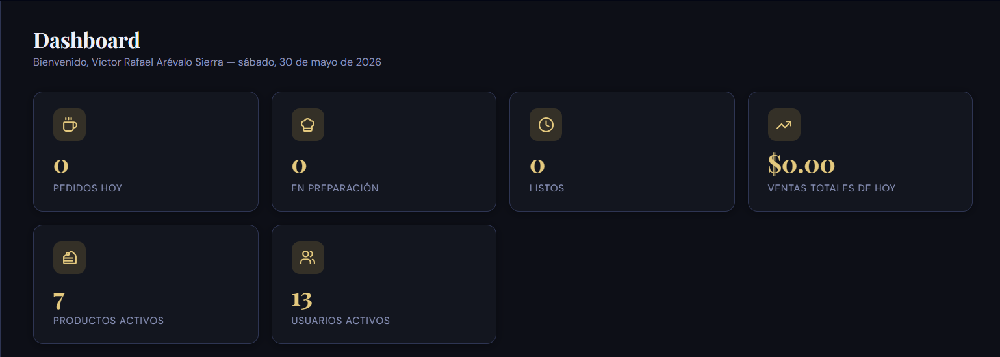

**Que veras:**
- **Tarjetas de estadisticas** en la parte superior: total de productos, usuarios activos, pedidos del dia, ingresos del dia.
- **Cuadricula de accesos rapidos** con iconos para cada modulo del sistema (Usuarios, Productos, Inventario, Ingredientes, Recetas, Caja, Promociones, Reportes, Mesas, Cocina, Despacho, Configuracion).
- **Usuarios en linea**: lista de usuarios conectados actualmente, actualizada en tiempo real.

Haz clic en cualquier tarjeta de acceso rapido para ir directamente a ese modulo.

### 3.2 Gestion de Productos y Combos

Esta pantalla te permite administrar el catalogo de productos y combos del negocio.

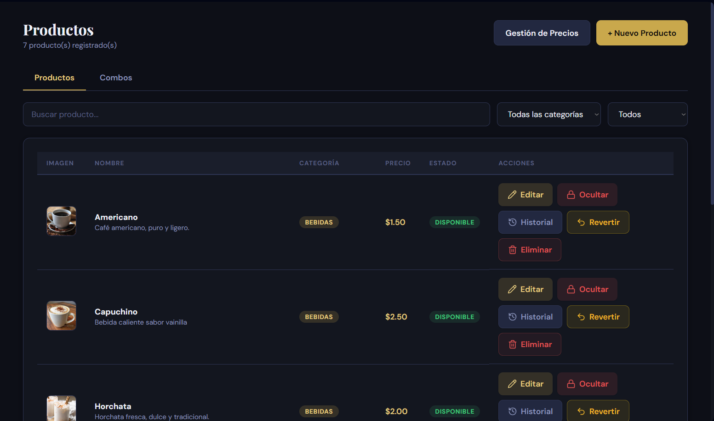

**Lista de productos:**
- La pantalla principal muestra una tabla con todos los productos: nombre, categoria, precio, stock, disponible/no disponible.
- Usa la **barra de busqueda** para filtrar por nombre.
- Usa el **selector de categoria** para filtrar por categoria.
- Usa el **selector de estado** para mostrar todos, solo disponibles o solo no disponibles.
- La paginacion en la parte inferior te permite navegar entre paginas.

**Crear un producto:**
1. Haz clic en el boton **+ Nuevo Producto**.
2. Completa los campos del formulario: nombre, descripcion, categoria, precio, stock, stock minimo.
3. Marca **Exento de IVA** si el producto no debe pagar impuesto (13% en El Salvador).
4. Opcional: sube una imagen haciendo clic en el area punteada y seleccionando un archivo.
5. Haz clic en **Guardar**.

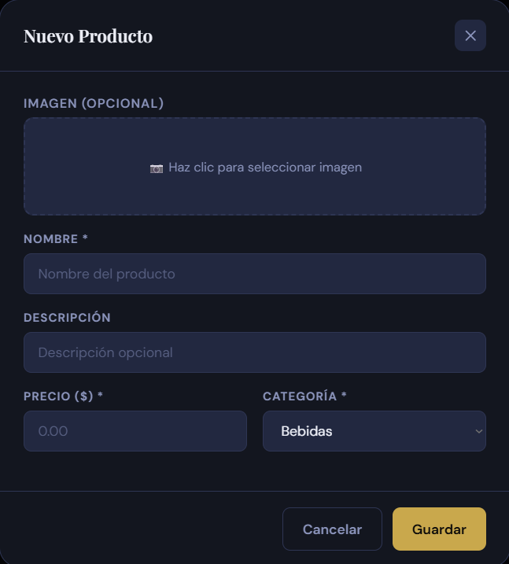

**Editar un producto:**
1. Haz clic en el icono de lapiz (Editar) en la fila del producto.
2. Modifica los campos necesarios.
3. Haz clic en **Guardar**.

**Deshabilitar un producto:**
1. Haz clic en el icono de candado (Toggle) en la fila del producto.
2. El producto cambiara a estado "No Disponible" y no aparecera en la Caja POS.

**Ver historial de precios:**
1. Haz clic en el icono de reloj (Historial) en la fila del producto.
2. Se mostrara una lista de los cambios de precio anteriores con fecha y usuario que lo modifico.
3. Puedes hacer clic en **Revertir** para volver al precio anterior.

**Combos:**
- La pestana **Combos** (al lado de Productos) muestra los combos disponibles.
- Para crear un combo, haz clic en **+ Nuevo Combo**, asigna un nombre, precio y selecciona los productos que lo componen con sus cantidades.
- El sistema valida que el precio del combo sea menor que la suma de sus partes.

**Actualizacion masiva de precios:**
1. Haz clic en el boton **Precios Masivo**.
2. Selecciona una categoria, el tipo de ajuste (porcentaje o monto fijo), y el valor.
3. El sistema actualizara todos los productos de esa categoria.

### 3.3 Gestion de Usuarios

Esta pantalla permite administrar las cuentas de los usuarios del sistema.

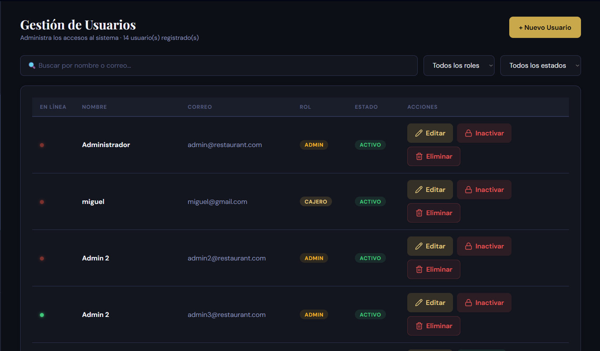

**Lista de usuarios:**
- Tabla con nombre, correo, rol (con etiqueta de color), estado (activo/inactivo) e indicador de conexion (verde si esta en linea).
- Busqueda por nombre o correo.
- Filtro por rol (Todos, Admin, Cajero, Cocinero, Despachador).

**Crear un usuario:**
1. Haz clic en **+ Nuevo Usuario**.
2. Completa: nombre, correo, contrasena, confirmar contrasena, rol.
3. La contrasena debe tener al menos 8 caracteres, una mayuscula, una minuscula, un numero y un caracter especial.
4. Haz clic en **Guardar**.

**Editar un usuario:**
1. Haz clic en el icono de lapiz.
2. Modifica los campos. Si no deseas cambiar la contrasena, dejala en blanco.
3. Haz clic en **Guardar**.

**Desactivar un usuario:**
1. Haz clic en el icono de candado.
2. Selecciona el motivo (opcional).
3. Confirma la desactivacion. El usuario no podra iniciar sesion.

**Activar un usuario:**
1. Haz clic en el icono de check en un usuario inactivo.
2. El usuario quedara habilitado nuevamente.

**Eliminar un usuario:**
1. Haz clic en el icono de papelera.
2. Confirma la eliminacion en dos pasos. Esta accion es permanente.

### 3.4 Gestion de Mesas

Esta pantalla muestra el mapa visual del restaurante con el estado de cada mesa.

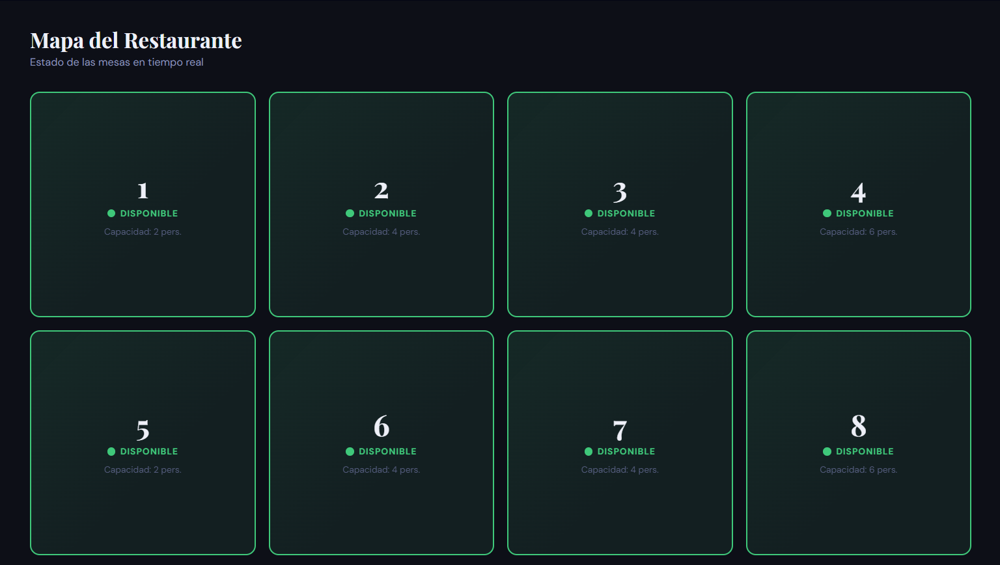

**Estados de mesa:**
- **Disponible** (verde): mesa libre.
- **Ocupada** (rojo): mesa con un pedido activo.
- **Pagando** (ambar): mesa en proceso de cobro.

Cada tarjeta muestra el numero de mesa, el estado y la capacidad de personas. El mapa se actualiza en tiempo real cuando cambia el estado de alguna mesa.

Para crear, editar o eliminar mesas, se debe hacer a traves de la API (funcionalidad administrativa interna).

### 3.5 Promociones

Gestiona las promociones y ofertas especiales del negocio.

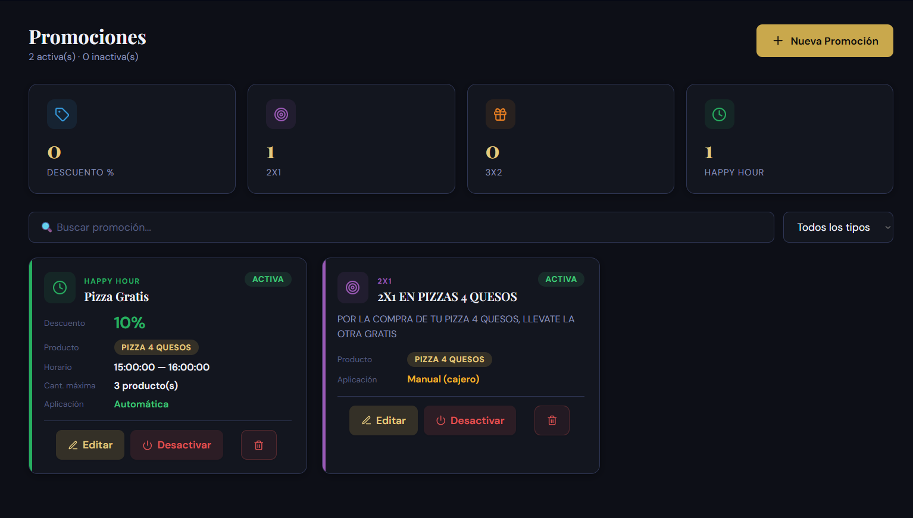

**Tipos de promocion:**
- **Descuento Porcentaje**: descuento de un porcentaje sobre productos especificos o categoria.
- **2x1**: el producto mas barato sale gratis al llevar dos.
- **3x2**: el producto mas barato sale gratis al llevar tres.
- **Happy Hour**: descuento porcentual con limite de aplicaciones por pedido.
- **Descuento Monto**: descuento de un monto fijo.

**Crear una promocion:**
1. Haz clic en **+ Nueva Promocion**.
2. Selecciona el tipo de promocion.
3. Completa: nombre, descripcion, valor del descuento, fecha de inicio y fin.
4. Opcional: selecciona un producto o categoria especifica a la que aplica, y cantidad maxima de usos por pedido.
5. Haz clic en **Guardar**.

**Activar/Desactivar:** usa el toggle en cada tarjeta de promocion.

**Nota:** Las promociones de tipo Happy Hour se activan automaticamente segun la hora configurada.

### 3.6 Inventario

Control de stock de productos.

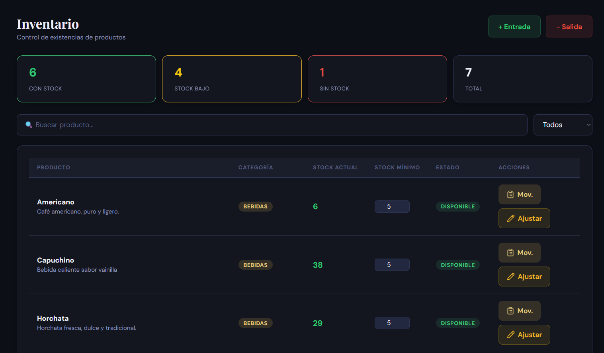

**Lista de inventario:**
- Muestra cada producto con su stock actual y stock minimo.
- Tiene codigo de colores: verde (stock ok), amarillo (stock bajo), rojo (sin stock).
- Filtros: busqueda por nombre, filtro por estado de stock (Todos, Bajo Stock, Sin Stock).

**Registrar entrada de stock:**
1. Haz clic en **Entrada** en el producto deseado.
2. Ingresa la cantidad a agregar y una descripcion.
3. Haz clic en **Confirmar**. El stock del producto aumentara.

**Registrar salida de stock:**
1. Haz clic en **Salida** en el producto deseado.
2. Ingresa la cantidad a retirar y una descripcion (ej: merma, ajuste).
3. Haz clic en **Confirmar**.

**Ajustar stock:**
1. Haz clic en **Ajustar** en el producto deseado.
2. Ingresa el nuevo valor de stock absoluto.
3. Haz clic en **Confirmar**.

**Ver movimientos:**
1. Haz clic en **Movimientos** en el producto deseado.
2. Se mostrara el historial de entradas, salidas y ajustes con fecha y usuario.

### 3.7 Ingredientes

Gestion de ingredientes para las recetas de los productos.

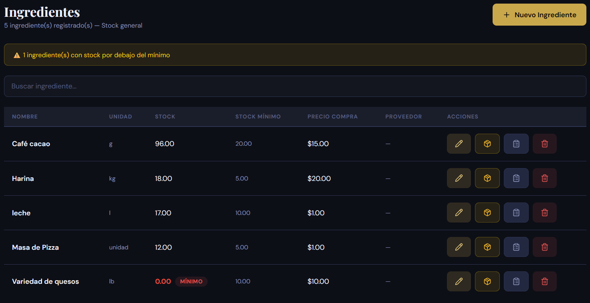

**Crear un ingrediente:**
1. Haz clic en **+ Nuevo Ingrediente**.
2. Completa: nombre, unidad de medida (unidad, gramos, litros, etc.), stock inicial, stock minimo, precio de compra.
3. Opcional: selecciona un proveedor asociado.
4. Haz clic en **Guardar**.

**Ajustar stock de ingrediente:**
1. Haz clic en el icono de ajuste en la fila del ingrediente.
2. Ingresa la nueva cantidad y el motivo del ajuste.
3. Confirma el cambio. Quedara registrado en el historial de movimientos.

**Ver movimientos:**
1. Haz clic en **Movimientos** en la fila del ingrediente.
2. Se mostraran las ultimas 50 operaciones realizadas sobre ese ingrediente.

**Eliminar ingrediente:**
1. Haz clic en el icono de papelera.
2. Confirma la eliminacion. Se realiza un soft-delete (el ingrediente queda oculto pero no se elimina de la base de datos).

### 3.8 Recetas

Asigna ingredientes a cada producto para controlar el costo de produccion.

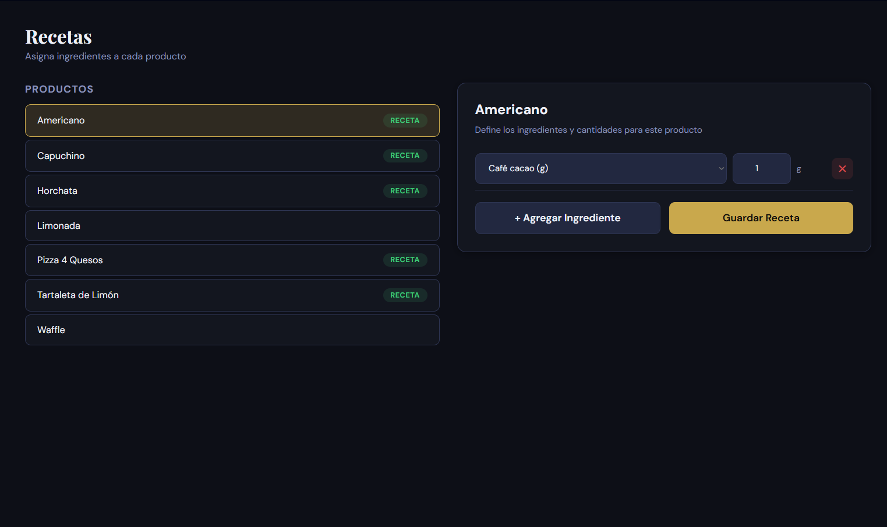

**Asignar receta a un producto:**
1. En el panel izquierdo, haz clic en el producto al que deseas asignarle una receta.
2. En el panel derecho, haz clic en **+ Agregar Ingrediente**.
3. Selecciona el ingrediente del menu desplegable.
4. Ingresa la cantidad necesaria para preparar una unidad del producto.
5. Repite para cada ingrediente necesario.
6. Haz clic en **Guardar Receta**.

Los productos que ya tienen receta asignada muestran una etiqueta verde "Receta" en la lista.

**Nota:** Las recetas se usan para descontar automaticamente del inventario de ingredientes cuando se crea un pedido.

### 3.9 Proveedores

Gestion de proveedores de ingredientes y productos.

**Funciones disponibles en la pantalla de Ingredientes:**
- Los proveedores se listan y gestionan como parte del modulo de Ingredientes.
- Al crear o editar un ingrediente, puedes asociarlo a un proveedor.

Para gestionar proveedores directamente, se accede desde el backend via API.

### 3.10 Reportes

Visualiza las metricas y el rendimiento del negocio.

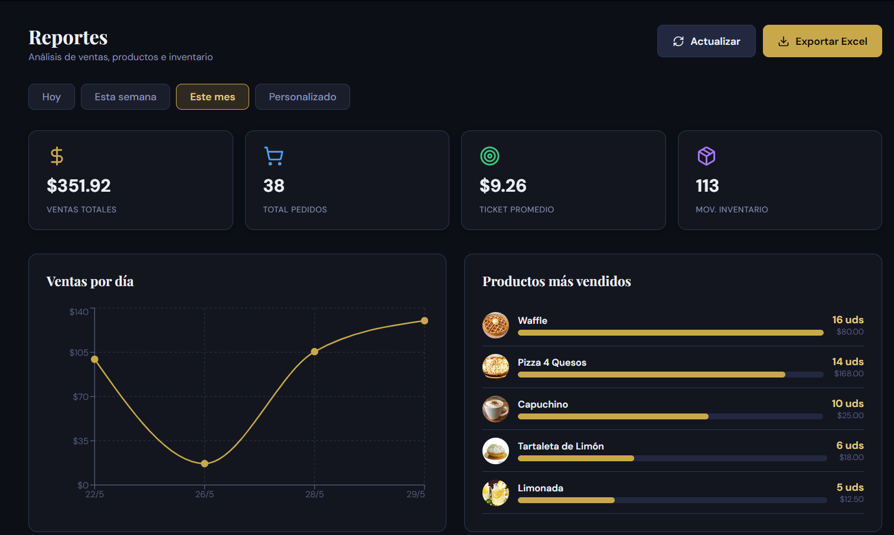

**Tipos de reporte:**
1. **Ventas por periodo**: grafico de linea con las ventas diarias del periodo seleccionado.
2. **Top productos**: lista de los productos mas vendidos.
3. **Movimientos de inventario**: resumen de entradas y salidas de stock.
4. **Resumen de caja**: ingresos y egresos del periodo.

**Generar un reporte:**
1. Selecciona el periodo: Hoy, Esta Semana, Este Mes o Personalizado (elige fecha inicio y fin).
2. El grafico de linea se actualizara mostrando las ventas del periodo.
3. Las tarjetas de estadisticas muestran: ingresos totales, numero de pedidos, ticket promedio, productos vendidos.
4. La tabla inferior muestra el detalle de los pedidos del periodo.

**Exportar a Excel:**
1. Genera el reporte con el periodo deseado.
2. Haz clic en el boton **Exportar Excel**.
3. El sistema descargara un archivo .xlsx con los datos del reporte.

### 3.11 Configuracion

Personaliza la experiencia del sistema.

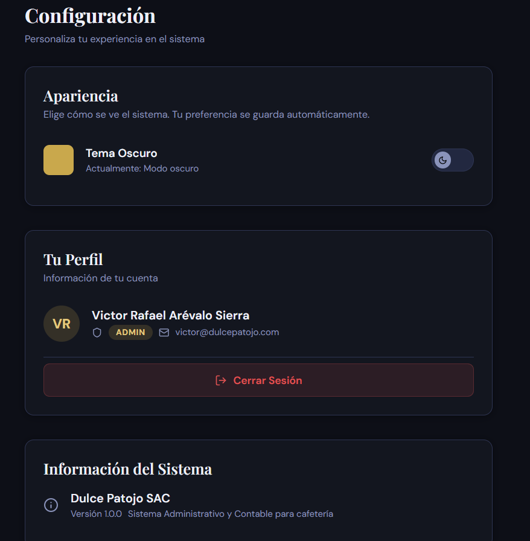

**Cambiar tema:**
1. Ve a la seccion **Apariencia**.
2. Usa el interruptor para cambiar entre tema Oscuro y Claro.
3. El cambio se guarda automaticamente.

**Ver perfil:**
- La seccion **Tu Perfil** muestra tu nombre, rol y correo electronico.

**Cerrar sesion:**
- Haz clic en el boton rojo **Cerrar Sesion** en la parte inferior.

---

## 4. Caja POS (Cajero)

La Caja POS es el modulo principal para registrar pedidos y procesar pagos. Esta pantalla esta disenada para ser rapida e intuitiva.

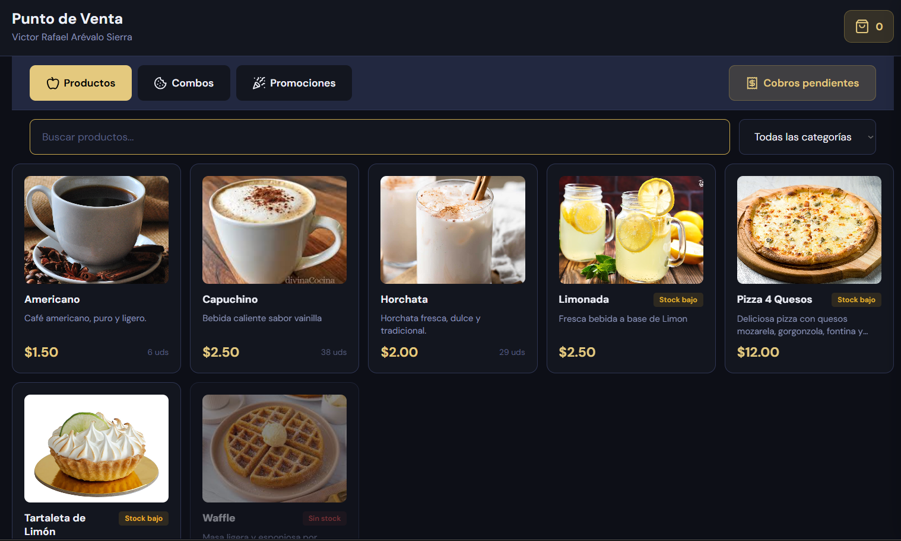

### 4.1 Realizar un pedido

**Paso 1: Seleccionar productos**
1. En el panel izquierdo, veras tres pestanas: **Productos**, **Combos**, **Promociones**.
2. Las categorias de productos aparecen como botones debajo de las pestanas. Haz clic en una categoria para filtrar.
3. Usa la **barra de busqueda** para encontrar productos por nombre.
4. Haz clic en el boton **Agregar** en la tarjeta del producto deseado. El producto se agregara al carrito en el panel derecho.
5. Ajusta la cantidad en el carrito usando los botones + y -.

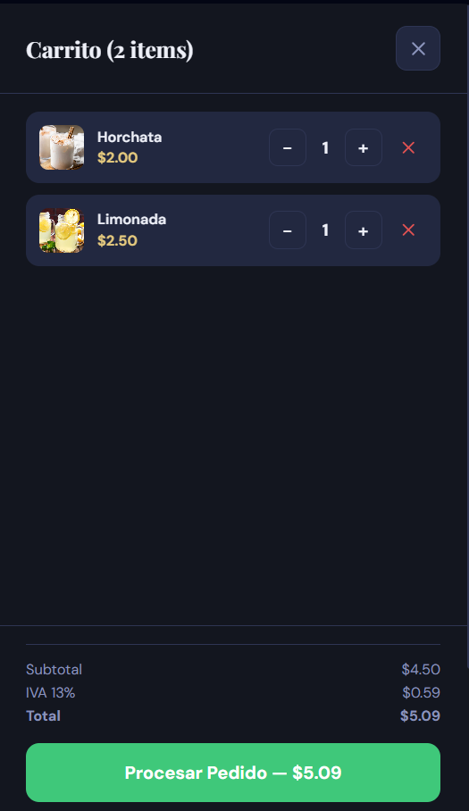

**Paso 2: Configurar tipo de pedido**
1. Antes de finalizar, selecciona el **tipo de pedido**:
   - **En Mesa**: el cliente consume en el local. Debes seleccionar una mesa.
   - **Para Llevar**: el cliente retira su pedido para consumir fuera.
   - **Para Recoger**: similar a para llevar, el cliente pasa a recoger.
   - **Domicilio**: envio a domicilio. Debes ingresar direccion y telefono de contacto.

2. Si seleccionaste **En Mesa**, aparecera un selector de mesas. Elige la mesa correspondiente.

3. Si seleccionaste **Domicilio**, se mostraran campos adicionales para direccion de entrega y telefono de contacto.

**Paso 3: Finalizar pedido**
1. Revisa el resumen del carrito: productos, cantidades, subtotal, descuentos aplicados, IVA (13%) y total.
2. Opcional: agrega notas al pedido (ej: "sin azucar", "bien tostado").
3. Haz clic en el boton **Procesar Pedido**.
4. Si es un pedido en mesa, la mesa cambiara automaticamente a Ocupada.
5. Si hay ingredientes asociados a los productos, el sistema descontara automaticamente del inventario.

 el pedido aparecera automaticamente en la pantalla de Cocina (KDS) para que el cocinero comience a prepararlo.

### 4.2 Procesar un pago

Una vez que el pedido esta listo y el cliente desea pagar:

**Paso 1: Acceder a cobros pendientes**
1. Haz clic en el boton **Cobros Pendientes** en la parte superior de la pantalla de Caja.
2. Se abrira un modal con la lista de pedidos pendientes de cobro (estado "Listo" o "Entregado").
3. Usa la busqueda o el filtro por mesa para encontrar el pedido.

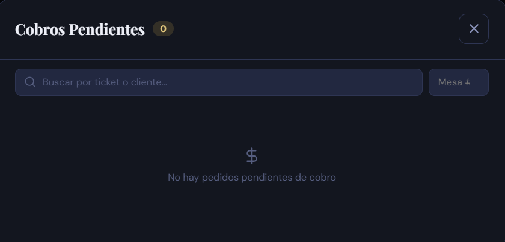

**Paso 2: Iniciar cobro**
1. Haz clic en **Iniciar Cobro** en el pedido correspondiente.
2. El sistema bloqueara el pedido para evitar que otro cajero lo procese al mismo tiempo.
3. Se abrira el modal de detalle de cobro.

**Paso 3: Registrar pago**
1. Revisa el detalle del pedido en la pestana **Detalle**: items comprados, subtotal, IVA, total.
2. En la pestana **Historial** puedes ver los cambios de estado del pedido.
3. Selecciona el **metodo de pago**:
   - Efectivo
   - Tarjeta
   - QR
   - Billetera Digital
   - Transferencia
4. Si seleccionaste **Efectivo**, ingresa el monto recibido. El sistema calculara automaticamente el cambio.
5. Opcional: ingresa un monto de **propina**.
6. Haz clic en **Confirmar Pago**.

El sistema procesara el pago, liberara la mesa (si aplica), y mostrara un mensaje de exito.

### 4.3 Cobros pendientes

El modal de Cobros Pendientes te permite:
- Ver todos los pedidos que estan listos para cobrar.
- Ver quien tiene bloqueado un pedido (si alguien mas inicio el cobro).
- Liberar un bloqueo si eres el mismo usuario que lo inicio o si eres administrador.
- El bloqueo expira automaticamente despues de un tiempo (visible en el temporizador).

### 4.4 Ticket de venta

Despues de procesar el pago:
1. Se mostrara el ticket con el detalle de la venta.
2. Puedes **Imprimir** el ticket (se abrira el dialogo de impresion del navegador).
3. Puedes **Descargar** el ticket como archivo HTML.
4. Haz clic en **Cerrar** para volver a la pantalla de Caja.

Para reimprimir un ticket de un pedido ya pagado, usa el boton **Reimprimir Ticket** desde el modal de Cobros Pendientes.

<!-- Imagen sugerida: captura del ticket de venta generado -->

---

## 5. Cocina KDS (Cocinero)

La pantalla de Cocina (Kitchen Display System) muestra los pedidos en tiempo real para que el cocinero gestione la preparacion.

<!-- Imagen sugerida: captura de la pantalla de Cocina KDS con las 3 columnas -->

### 5.1 Visualizar pedidos entrantes

La pantalla se divide en tres columnas:

| Columna | Estado | Que significa |
|---|---|---|
| Pendientes | Recibido | Pedidos nuevos que esperan ser preparados |
| En Preparacion | En preparacion | Pedidos que estas cocinando actualmente |
| Listos | Listo | Pedidos terminados esperando despacho |

- Los pedidos nuevos aparecen automaticamente en la columna **Pendientes** y el sistema emite un sonido de notificacion.
- Cada tarjeta de pedido muestra: numero de ticket, nombre del cliente, tipo de pedido, tiempo transcurrido desde que se recibio, y la lista de productos con cantidades.

### 5.2 Cambiar estado de preparacion

**Iniciar preparacion:**
1. Ubica el pedido en la columna **Pendientes**.
2. Haz clic en el boton **Iniciar Preparacion**.
3. El pedido se movera a la columna **En Preparacion**.

**Marcar como listo:**
1. Ubica el pedido en la columna **En Preparacion**.
2. Haz clic en el boton **Marcar como Listo**.
3. El pedido se movera a la columna **Listos** y aparecera automaticamente en la pantalla de Despacho.

**Nota:** Los botones cambian de color segun el estado: azul para pendientes, ambar para en preparacion, verde para listos.

### 5.3 Consultar recetas

1. Haz clic en el boton **Ver Receta** en la tarjeta de un pedido.
2. Se abrira un modal que muestra los ingredientes necesarios para cada producto del pedido.
3. Util para verificar que tienes los ingredientes suficientes antes de comenzar.

---

## 6. Despacho (Despachador)

La pantalla de Despacho gestiona la entrega de pedidos al cliente final.

<!-- Imagen sugerida: captura de la pantalla de Despacho -->

### 6.1 Recibir pedidos listos

- Los pedidos marcados como **Listos** por el cocinero aparecen automaticamente en el panel principal de Despacho.
- Cada tarjeta muestra: numero de ticket, tipo de pedido (En Mesa, Para Llevar, Para Recoger, Domicilio), lista de productos, nombre del cliente, y tiempo desde que esta listo.
- Una notacion visual indica si el pedido es para entrega inmediata o para domicilio.

### 6.2 Entregar pedidos

**Entrega en mostrador (Para Llevar, Para Recoger):**
1. Localiza el pedido por numero de ticket o nombre del cliente.
2. Entrega los productos al cliente.
3. Haz clic en el boton **Entregar** en la tarjeta del pedido.
4. El pedido pasara al panel lateral de **Entregados Recientemente**.

**Entrega a domicilio:**
1. Verifica que la direccion y telefono de contacto esten visibles en la tarjeta del pedido.
2. Entrega al repartidor asignado.
3. Haz clic en **Entregar**. El pedido se registrara como entregado.

### 6.3 Ver ticket de entrega

1. En cualquier pedido (listo o entregado), haz clic en el icono de **Ticket** o **Ver Ticket**.
2. Se abrira el modal con el ticket completo del pedido.
3. Desde aqui puedes **Imprimir** o **Descargar** el ticket para entregarlo al cliente.

---

## Solucion de problemas comunes

| Problema | Causa posible | Solucion |
|---|---|---|
| No puedo iniciar sesion | Credenciales incorrectas | Verifica tu correo y contrasena. Si olvidaste la contrasena, contacta al administrador. |
| Mi sesion se cerro sola | Inactividad por mas de 30 minutos | Vuelve a iniciar sesion. |
| No veo las opciones del menu | Tu rol no tiene acceso a esa seccion | Contacta al administrador si necesitas cambios de permiso. |
| Un pedido no aparece en Cocina | Problema de conexion WebSocket | La pantalla se actualiza automaticamente cada 15 segundos. Espera o refresca la pagina. |
| No puedo iniciar un cobro | Otro cajero ya lo inicio | El pedido tiene un bloqueo activo. Espera a que se libere o contacta al administrador. |
| El stock no se descuenta | El producto no tiene receta asignada | Asigna los ingredientes y cantidades en el modulo de Recetas. |

---

## Soporte tecnico

Para reportar errores o solicitar ayuda, contacta al administrador del sistema o abre un issue en el repositorio oficial:

- Repositorio: https://github.com/mglreyes25/Dulce-Patojo
- Documentacion tecnica: https://github.com/mglreyes25/Dulce-Patojo/blob/main/DOCUMENTACION_TECNICA.md

---

*Documento generado para la entrega del proyecto Dulce Patojo SAC v1.0.0*
